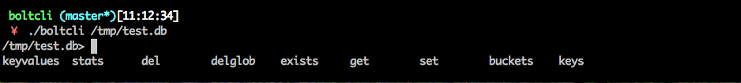

## Feature

* Support CRUD commands on the bucket/key in repl-like command line. You can consider it as `redis-cli` for boltdb.
* You can eval Lua script with given database. It makes maintaining boltdb more easily.

## Usage

`boltcli  [-e script] /path/to/db`

## Commands

See [Commands](./Commands.md)

## Lua support

You could run a lua script on specific database like this: `boltcli -e your.lua db_path`.
`boltcli` provides a couple of API within the global variable `bolt`. For example:
```lua
bolt.get("bucket", "key") -- return the value of `key` as a lua string
-- is equal to > get bucket key in the command line
```

See [test.lua](./test.lua) as a concrete example.
